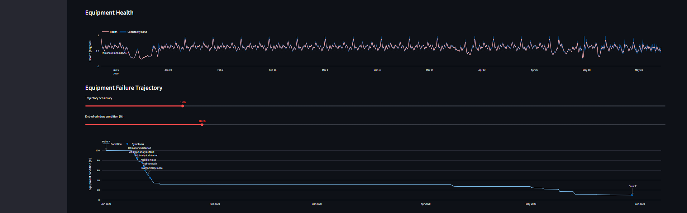
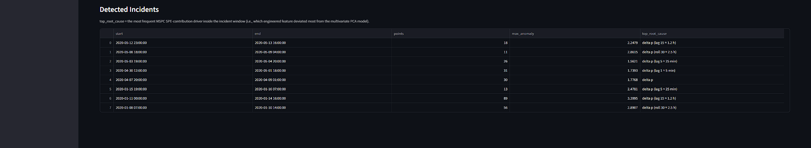
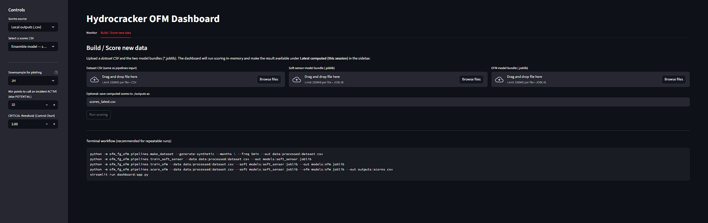

# Hydrocracker Prediction Dashboard — Fuel Gas Soft Sensor + Multivariate OFM (MSPC)

An end‑to‑end **process monitoring** project for a hydrocracker:
1) train a **Fuel Gas soft sensor** (regression),
2) convert prediction errors into a **residual‑based OFM layer** (EWMA + persistence),
3) add a **multivariate MSPC layer** (PCA → Hotelling T² + SPE/Q),
4) visualize everything in a **Streamlit dashboard** (actual vs predicted, residuals, alarms, root cause).

---

## What this repo does

### Fuel‑Gas Soft Sensor (regression)
Predicts *expected* fuel‑gas energy (or proxy) from process signals (reactor T/P, feed rate, ΔP, etc.).
The model output is `y_pred`. The measured value is `y_actual`.

### Residual Monitoring (univariate OFM)
Residual = `y_actual - y_pred`

We compute:
- **EWMA** of residual (`residual_ewma`)
- deviation-from-EWMA (`residual_dev`)
- an alarm using **persistence** rules (avoid chattering)

These drive the dashboard plots:
- *Actual vs Predicted*
- *Residual & EWMA*
- *Residual deviation / alarm logic*

### MSPC Layer (multivariate OFM)
Using numeric process features, we fit PCA on a **baseline** window and score:
- **Hotelling T²**
- **SPE/Q**
- combined **Health Index** + persistence alarms

Root cause is estimated using top PCA contribution logic.

---

## Project layout

- `src/ofm_fg_ofm/` — pipelines + model logic
- `src/ofm_fg_ofm/data/synthetic/` — synthetic generator
- `src/ofm_fg_ofm/pipelines/`  
  - `generate_synth.py` → synthetic raw data
  - `make_dataset.py` → feature build + canonical target name
  - `train_soft_sensor.py` → train soft sensor (**supports ensemble**)
  - `train_ofm.py` → fit MSPC baseline + residual limits
  - `score_ofm.py` → produce `outputs/*.csv` consumed by the dashboard
- `dashboard/app.py` — Streamlit UI

---

## Quickstart (demo)

This repo **does not ship pre-generated data/models**.

Run the demo pipeline once to generate:
- 5 months of synthetic data at 5-minute sampling
- models (soft sensor + OFM/MSPC)
- `outputs/*.csv` consumed by the Streamlit dashboard

```bash
pip install -r requirements.txt
pip install -e .

# Generate data + train + score
python scripts/run_demo_pipeline.py --months 5 --freq 5min --ensemble

# Launch dashboard (auto-discovers outputs/*.csv)
streamlit run dashboard/app.py
```

---

## Full pipeline (generate → train → score)

```bash
# 1) Make dataset (generates synthetic data by default)
python -m ofm_fg_ofm.pipelines.make_dataset --out data/processed/dataset.csv --generate-synthetic --months 5 --freq 5min

# 2) Train soft sensor (single model)
python -m ofm_fg_ofm.pipelines.train_soft_sensor --data data/processed/dataset.csv --out models/soft_sensor.joblib --model hgb

# 2b) Train soft sensor (ensemble)
python -m ofm_fg_ofm.pipelines.train_soft_sensor --data data/processed/dataset.csv --out models/soft_sensor_ensemble.joblib --model ensemble

# 3) Train OFM baseline (MSPC + residual limits)
python -m ofm_fg_ofm.pipelines.train_ofm --data data/processed/dataset.csv --soft models/soft_sensor_ensemble.joblib --out models/ofm.joblib

# 4) Score and export for dashboard
python -m ofm_fg_ofm.pipelines.score_ofm --data data/processed/dataset.csv --soft models/soft_sensor_ensemble.joblib --ofm models/ofm.joblib --out outputs/scores.csv
```

---

##  Ensemble model: 

When you switch `train_soft_sensor.py --model ensemble`:
-  `y_pred` changes (better bias/variance tradeoff in many cases)
-  residual plots change (`residual`, `residual_ewma`, `residual_dev`)
-  residual‑based alarms can change (because limits are learned from residual stats)
-  “Actual vs Predicted” chart changes

What stays the same (unless you re-train MSPC on different features / baseline window):
- MSPC features (T²/SPE) depend on the process feature matrix; not on the regressor *directly*
- However, if you **re-train** `train_ofm.py`, the baseline selection and limits can shift slightly.

**Important note:** an ensemble is not automatically “more powerful for unseen data” — it often helps generalization, but you still need:
- time‑series aware validation (forward split),
- drift monitoring,
- periodic recalibration.

---

## License
See `LICENSE`.


## Dashboard: Build / Score (in-app)

The Streamlit dashboard also supports *in-app scoring*:

1. Open the **Build / Score new data** tab.
2. Upload:
   - a **dataset CSV** (same format you pass to the pipelines)
   - **soft-sensor** model bundle (`models/soft_sensor*.joblib`)
   - **OFM** model bundle (`models/ofm*.joblib`)
3. Click **Run scoring inside dashboard**.
4. Switch back to **Monitor** and select **Latest computed**.

You can also export the computed scores back to `outputs/` from the Build tab.

Note: Advanced mode requires the package to be importable. From the project root run:

```bash
pip install -e .
```

---
## Dashboard Preview





